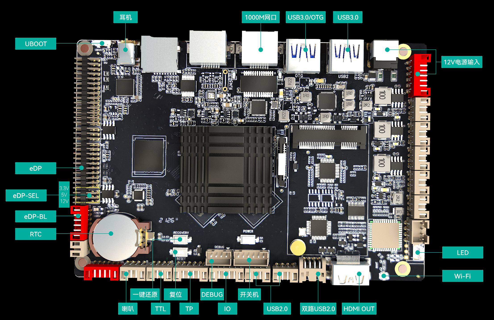
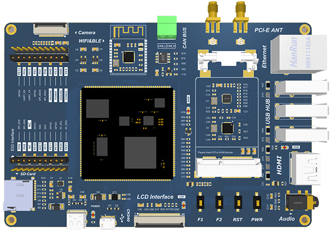

# device_board_iSoftStone

## 简介

### 开发板简介

- 扬帆开发板

“扬帆”装载瑞芯微RK3399芯片，基于Big.Little架构，其丰富的扩展接口可实现LCD显示、触摸、多媒体、上网等基本特性，可广泛应用于互动广告机、互动数字标牌、智能自助终端、智能零售终端、工控主机、机器人设备等各类场景。



- 致远开发板

致远是一片尺寸为150mm100mm15mm的开发板，其结构紧凑，功能强大，外形美观，开发板上搭载有庞大的资源外设，配套有DevEco Device Tool开发、调试环境，部分教程以及实验案例，开发者可以根据需求自由开发。



## 目录

```
device/board/isoftston				
├── yangfan                 			  # yangfan board
└── zhiyuan                 			  # zhiyuan board                        
```

## 使用说明

扬帆 参考:
- [yangfan](https://gitee.com/openharmony-sig/device_board_isoftstone/tree/master/yangfan/README_zh.md)

致远 参考:
- [zhiyuan](https://gitee.com/openharmony-sig/device_board_isoftstone/tree/master/zhiyuan/README_zh.md)


## 相关仓

* [vendor_isoftstone](https://gitee.com/openharmony-sig/vendor_isoftstone)
* [device_soc_rockchip](https://gitee.com/openharmony-sig/device_soc_rockchip)
