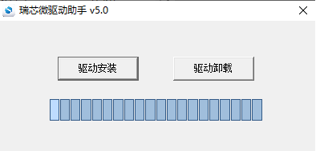
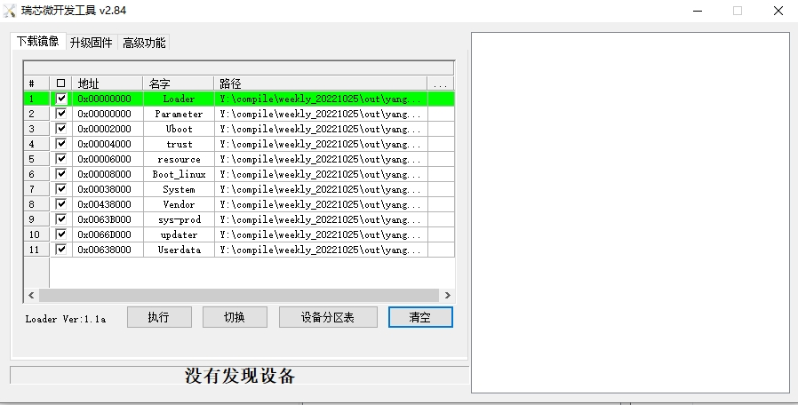
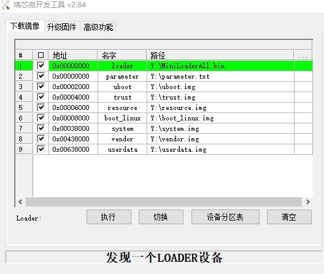

# 【开发板名称】扬帆富设备开发板

**简介**

“扬帆富设备开发板”（以下简称“扬帆开发板”）搭载瑞芯微RK3399芯片，基于Big.Little架构，其丰富的扩展接口可实现LCD显示、触摸、多媒体、上网等基本特性，可广泛应用于互动广告机、互动数字标牌、智能自助终端、智能零售终端、工控主机、机器人设备等各类场景。

“扬帆”开发板外观图如图1所示：


图1：扬帆开发板外观图

# 扬帆开发板开发指南

本文档用来指导开发者在扬帆开发板上进行OpenHarmony系统的移植开发。

## 开发环境准备

### 安装工具

安装命令如下：

```
sudo apt-get update && sudo apt-get install binutils git git-lfs gnupg flex bison gperf build-essential zip curl zlib1g-dev gcc-multilib g++-multilib libc6-dev-i386 lib32ncurses5-dev x11proto-core-dev libx11-dev lib32z1-dev ccache libgl1-mesa-dev libxml2-utils xsltproc unzip m4 bc gnutls-bin python3.8 python3-pip
```

**说明：** 
>以上安装命令适用于Ubuntu18.04，其他版本请根据安装包名称采用对应的安装命令。

### 获取标准系统源码

#### 前提条件

1.  注册码云gitee账号。
2.  注册码云SSH公钥，请参考[码云帮助中心](https://gitee.com/help/articles/4191)。
3.  安装[git客户端](http://git-scm.com/book/zh/v2/%E8%B5%B7%E6%AD%A5-%E5%AE%89%E8%A3%85-Git)和[git-lfs](https://gitee.com/vcs-all-in-one/git-lfs?_from=gitee_search#downloading)并配置用户信息。

    ```
    git config --global user.name "yourname"
    git config --global user.email "your-email-address"
    git config --global credential.helper store
    ```

4.  安装码云repo工具，可以执行如下命令。

    ```
    curl -s https://gitee.com/oschina/repo/raw/fork_flow/repo-py3 > /usr/local/bin/repo  #如果没有权限，可下载至其他目录，并将其配置到环境变量中
    chmod a+x /usr/local/bin/repo
    pip3 install -i https://repo.huaweicloud.com/repository/pypi/simple requests
    ```


#### 操作步骤

方式一（推荐）：通过repo + ssh 下载（需注册公钥，请参考[码云帮助中心](https://gitee.com/help/articles/4191)）。

```
repo init -u ssh://git@gitee.com/openharmony-sig/manifest.git -b master -m devboard_yangfan.xml --no-repo-verify
repo sync -c
repo forall -c 'git lfs pull'
```

方式二：通过repo + https 下载。

```
repo init -u https://gitee.com/openharmony-sig/manifest.git -b master -m devboard_yangfan.xml --no-repo-verify
repo sync -c
repo forall -c 'git lfs pull'
```

### 执行prebuilts

在源码根目录下执行脚本，安装编译器及二进制工具。

```
bash build/prebuilts_download.sh
```

下载的prebuilts二进制默认存放在与OpenHarmony同目录下的OpenHarmony\_2.0\_canary\_prebuilts下。

## 编译

在Linux环境进行如下操作:

1.  进入源码根目录，执行如下命令进行版本编译。

    ```
    bash device/rockchip/product/rk3399_prebuild.sh
    ./build.sh --product-name rk3399 --ccache
    ```
2.  检查编译结果。编译完成后，log中显示如下：

    ```
    post_process
    =====build rk3399 successful.
    2021-09-13 09:22:28
    ```
    编译所生成的文件都归档在out/ohos-arm-release/目录下，结果镜像输出在out/ohos-arm-release/packages/phone/images/ 目录下。

3.  编译源码完成，请进行镜像烧录。

## 烧录方法
先将tools目录拷贝到windows下

### 安装驱动
解压DriverAssitant_v5.1.1.zip，然后运行DriverInstall.exe。



### 安装烧录工具
解压RKDevTool_Release.zip，双击运行RKDevTool.exe。



### 烧录
运行RKDevTool.exe后，选择对应的镜像，按reset后然后长按uboot键，软件底部出现**发现一个LOADER设备**后点击执行，然后等待烧录完成。



## 后续

单板烧录完成后，可以在扬帆开发板上运行和测试OpenHarmony系统，在后续可以根据开发者的需求对系统进行裁剪，增加等定制化开发。