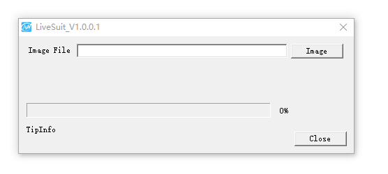
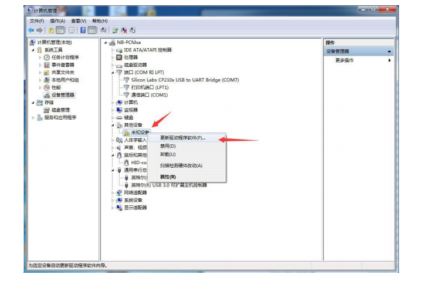
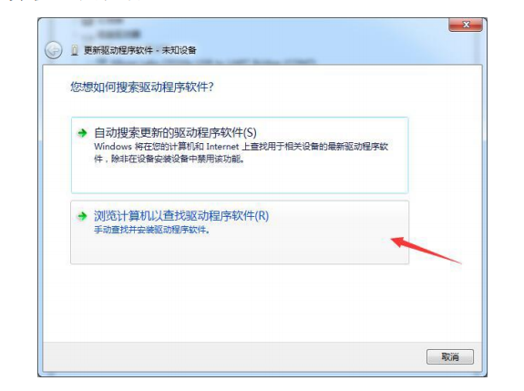
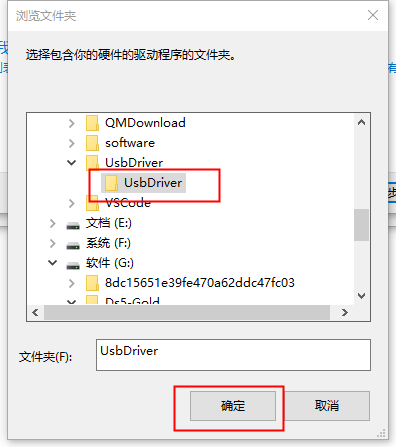
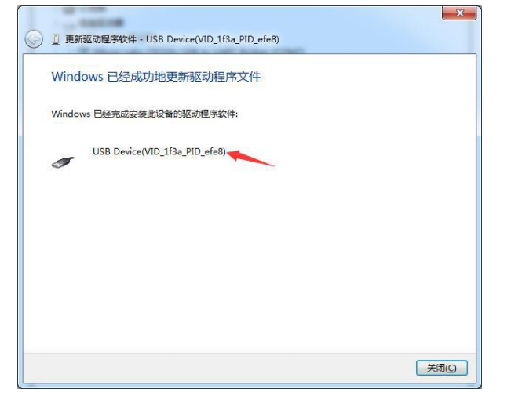
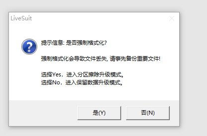
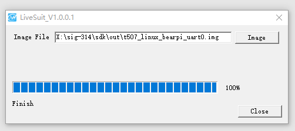

# 【开发板名称】致远开发板

**简介**

“致远”装载全志T507芯片，基于ARM架构，四核64位处理器，支持蓝牙、WIFI、音频、视频和摄像头等功能。拥有丰富的扩展接口，以及多种视频输入输出接口；
适用于工业控制、智能驾舱、智慧家居、智慧电力、在线教育等诸多行业需求。

“致远”开发板外观图如图1所示：


图1：致远开发板外观图

# 致远开发板开发指南

本文档用来指导开发者在致远开发上进行鸿蒙系统的移植开发。

## 开发板规格

全志 T507采用四核64位Cortex-A53处理器，主频高达1.5GHz，集成Mali-400 G31 GPU，具有低功耗高性能的特点，可广泛应用于工业控制、智能驾舱、智慧家居、智慧电力、在线教育等诸多行业需求。

致远开发板MCU/处理器规格及规格清单如表1所示：

<table>
   <tr>
        <td>芯片</td> 
        <td>全志 T507 芯片</td> 
   </tr>
   <tr>
        <td>架构</td> 
        <td>ARM</td> 
   </tr>
    <tr>
        <td>主频</td> 
        <td>1.5GHz</td> 
   </tr>
    <tr>
        <td>工作电压</td> 
        <td>2V~8V</td> 
   </tr>
    <tr>
        <td>内存&存储</td> 
        <td>2GBLPDDR4, 8GB Flash</td> 
   </tr>
   <tr>
        <td rowspan="5">通用规格</td>    
        <td >支持OpenHarmony、Linux系统</td>  
    </tr>
    <tr>
        <td >百兆网口：可通过该网口访问和传输内外网的数据，提高网络传输效率</td>  
    </tr>
    <tr>
        <td >多屏异显：最多可以满足双屏异显功能</td>  
    </tr>
    <tr>
        <td >核心板尺寸 150mm*100mm*15mm，可满足小型终端产品空间需求</td>  
    </tr>
    <tr>
        <td >丰富的扩展接口，支持多种视频输入输出接口（详见底板规格说明）</td>  
    </tr>
</table>


表1 致远开发板MCU/处理器规格及规格清单规格

致远开发板底板规则说明如表2所示：

| **致远底板规格说明**   |                                                                                                              |
|------------------------------|--------------------------------------------------------------------------------------------------------|
| 显示接口                     | 1xHDMI2.0 支持4K 60fp , 1x双通道LVDS接口 															|
| 音频接口                     | 1x耳机输出 (3.5mm耳机座)        																	    |
| 以太网                       | 1x GMAC(10/100)                                                                                        |
| 无线网络                     | SDIO接口，支持WIFI 2.4G  BT4.2                                                                         |
| 摄像头接口                   | 支持Mipi和USB接口                                                          							|
| USB                          | 1x Type-C + 3 x USB Host                        														|
| PCIe                         | Mini Pcie                                                            									|
| SDMMC                        | 最大支持64GB                                                                         					|
| 按键                         | 板载一个Recovery按键，一个reset按键，二个GPIO按键                                                      |
| 调试                         | UART 串口6路TTL3.3V电平，其中一路为Debug                                                               |
| FAN                          | 1x Fan                                                                                                 |
| 扩展接口                     | 98路GPIO接口、6路PWM3.3V电平、两路ADC接口、5路I2C接口、两路以太网，GMAC和EMAC PHY 接口、一路CVBS输出 	|
| 底板尺寸                     | 150mm×100mm×15mm                                                                                       |
| PCB 规格                     | 4 层板                                                                                                 |
| 电源管理                     | 电源管理芯片AXP853T，支持待机和按键开关机                                                              |
| 工作温度                     | 工业级运行温度-25~+75摄氏度，连续运行寿命大于5年                                                             |


表2 致远开发板底板规则说明

## 开发板功能

**·** 高性价比：适合中小规模企业/用户使用。

· 高速网口：可通过网口访问和传输内外网数据，提供稳定可靠的网络传输性能。

· 工作温度范围大：工作温度从-25~+75摄氏度，适用于各种工业应用场景。

· 支持CAN接口： Can总线接口是一种功能丰富的车用总线标准，用于车辆设备通信，在智能驾驶和汽车行业有广泛应用。

· 支持多系统：支持OpenHarmony、Linux系统。

## 搭建开发环境

### 前置条件

1）注册码云gitee账号。

2）注册码云SSH公钥，请参考[码云帮助中心](https://gitee.com/help/articles/4191)。

3）安装[git客户端](https://gitee.com/link?target=http%3A%2F%2Fgit-scm.com%2Fbook%2Fzh%2Fv2%2F%E8%B5%B7%E6%AD%A5-%E5%AE%89%E8%A3%85-Git)和[git-lfs](https://gitee.com/vcs-all-in-one/git-lfs?_from=gitee_search#downloading)并配置用户信息。

```
git config --global user.name "yourname"

git config --global user.email "your-email-address"

git config --global credential.helper store
```

4）安装码云repo工具，可以执行如下命令。

```
curl -s https://gitee.com/oschina/repo/raw/fork_flow/repo-py3 > /usr/local/bin/repo #如果没有权限，可下载至其他目录，并将其配置到环境变量中

chmod a+x /usr/local/bin/repo

pip3 install -i [https://repo.huaweicloud.com/repository/pypi/simple](https://gitee.com/link?target=https%3A%2F%2Frepo.huaweicloud.com%2Frepository%2Fpypi%2Fsimple) requests
```

### 获取代码流程

1：创建项目文件夹

2：进入项目文件夹

3：使用repo工具下载资源仓库

4：下载所有仓库当前分支的代码

5：下载仓库大容量二进制文件

6：下载并安装编译器及二进制工具

```
mkdir openharmony

cd openharmony

repo init -u https://gitee.com/openharmony/manifest.git --no-repo-verify

repo sync -c

repo forall -c 'git lfs pull'

bash ./build/prebuilts_download.sh
```

### 编译流程

进入源码根目录，执行如下命令进行编译。

1：编译zhiyuan的system.img/vendor.img等

2：进入pack目录

3：生成img镜像文件

4：进入out目录可看到生成的镜像文件

```
./build.sh --product-name zhiyuan               

cd ./device/board/isoftstone/zhiyuan/kernel/build    

./pack.sh                                       

cd ../../../../../../out/
```

镜像文件为：t507_linux_zhiyuan_uart0.img

## 开发板烧录

**注意：本文档基于致远开发进行说明。**

### 1、获取烧写软件：

​	路径链接： https://gitee.com/vyagoo_0/seed_tools/tree/master/tools

​	下载到本地后解压后得到如下文件：

```sh
├── LiveSuit.zip    					# 烧录工具
└── UsbDriver.zip   					# 烧录工具所需驱动
```

​	解压相应压缩包，解压LiveSuit.zip并运行LiveSuit.exe如下：



​	点击Image选择需要升级的镜像文件

### 2、安装驱动

**注意：该步骤一般在首次刷机才需要，安装成功之后就不需要再次进行该步骤。**

开发板无镜像上电或者切换至 usb 升级模式时，如果 PC 端没有安装驱动，在设备管理 器中将会被识别成未知设备，按以下步骤安装 usb 驱动即可： 驱动在解压出来的的目录下：UsbDriver

开发板上电开机，用 MicroUSB 线连接到电脑，查看是否检测到设备(首次需要安装驱动)

打开设备管理器，找到未识别设备，选择右键菜单“更新驱动”



选择浏览计算机查找驱动



进入解压出的目录：选择 UsbDriver 目录



等待设备安装完成，如下：



驱动安装完成，开发板切换到升级状态时，会被识别成 USB Device(VID_1f3a_PID_efe8)

### 3、刷机

- 确保驱动安装后，确保机器上电并且连接好miniUSB数据线后，切换板子到升级模式即可开始烧录，切换方式如下：

​		按住开发板上的**OTA按键**，然后按**RST按键**，如弹出如下弹窗说明开发板进去升级模式。

- 根据需求选择**(是)**或**(否)**便开始自动刷机



- 进度条更新，等待烧写成功即可。


